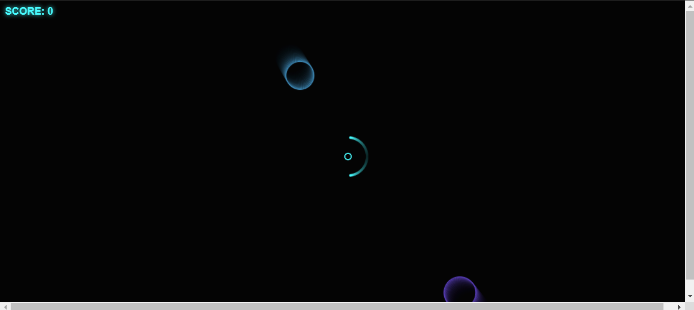

# JOGO DO ECLIPSE
☑️JOGO EM HTML/CSS/JS.

   

## DESCRIÇÃO:
Esse é um jogo meio abstrato, mas com cara de Sci-Fi, no qual o jogador deve se defender contra inimigos invasores disparando projéteis na direção do ponteiro do mouse.

Neste projeto foi usado HTML, CSS e JavaScript vanilla (linguagem pura, sem bibliotecas ou frameworks) e apenas desenhos feitos no próprio canvas.

## NÃO SABE?
- Entendemos que para manipular arquivos em `HTML`, `CSS` e outras linguagens relacionadas, é necessário possuir conhecimento nessas áreas. Para auxiliar nesse aprendizado, oferecemos cursos gratuitos disponíveis:
* [CURSO DE CANVAS](https://github.com/VILHALVA/CURSO-DE-CANVAS)
* [CURSO DE HTML E CSS](https://github.com/VILHALVA/CURSO-DE-HTML-E-CSS)
* [CURSO DE JAVASCRIPT](https://github.com/VILHALVA/CURSO-DE-JAVASCRIPT)
* [CONFIRA MAIS CURSOS](https://github.com/VILHALVA?tab=repositories&q=+topic:CURSO)

## CREDITOS:
- [PROJETO CRIADO PELO "GustavoASIlveira"](https://github.com/GustavoASIlveira/eclipse)
- [PLAYLIST DO YOUTUBE](https://www.youtube.com/playlist?list=PLclUTiUoLCbDHjxnd4FyliJuVeHS22pAK)
- [PROJETO EDITADO PELO VILHALVA](https://github.com/VILHALVA)
